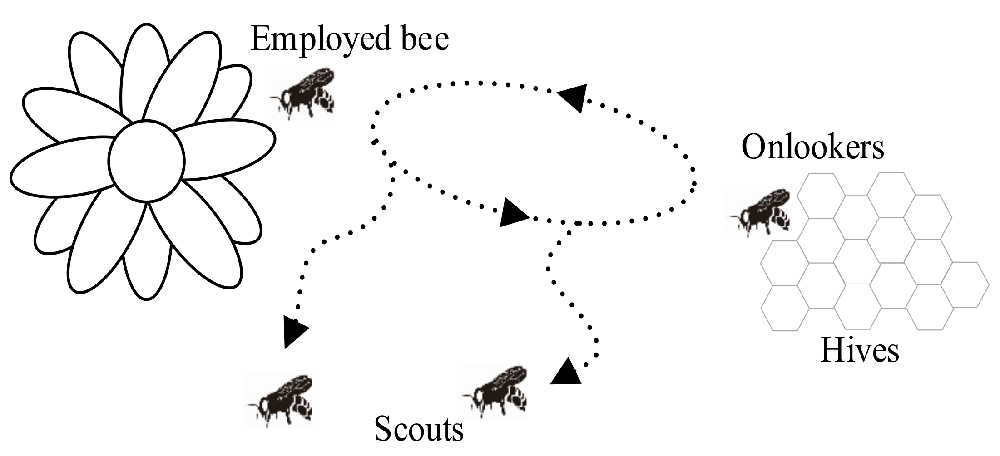
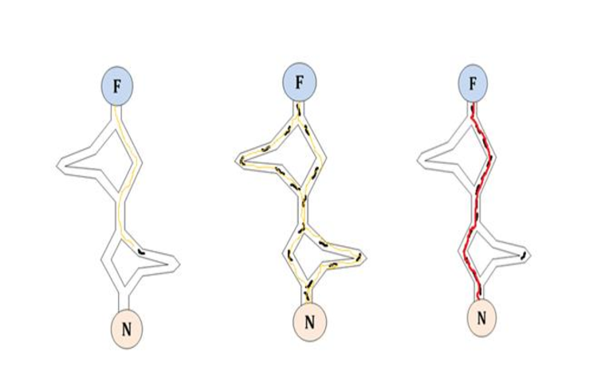
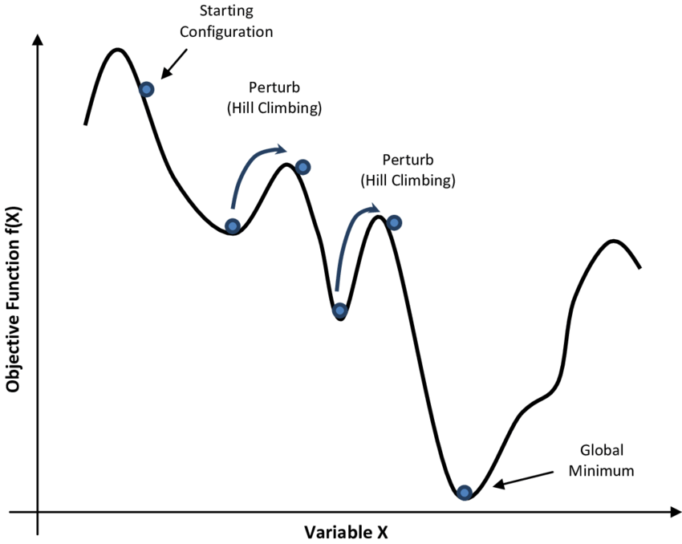
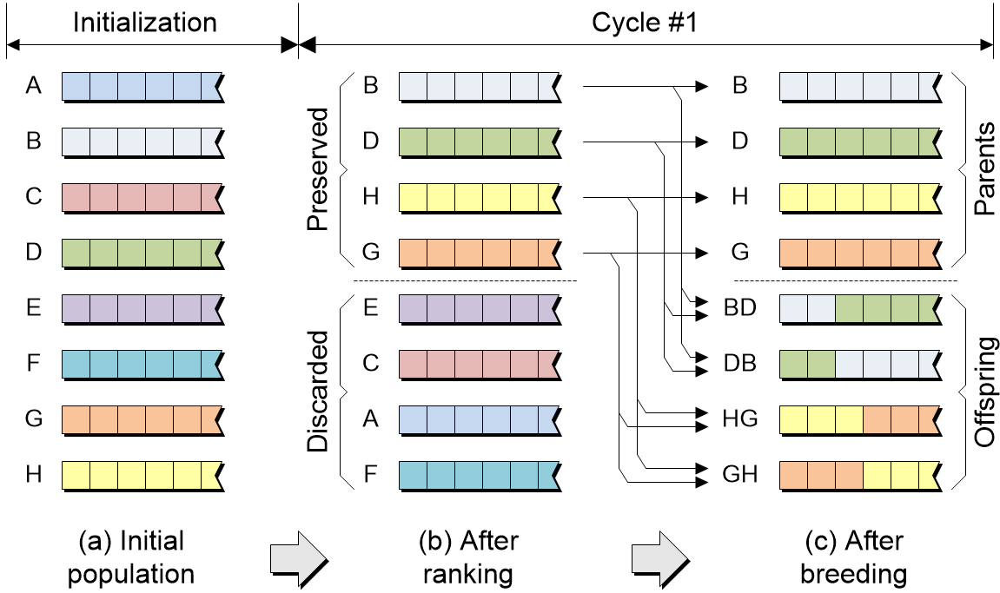
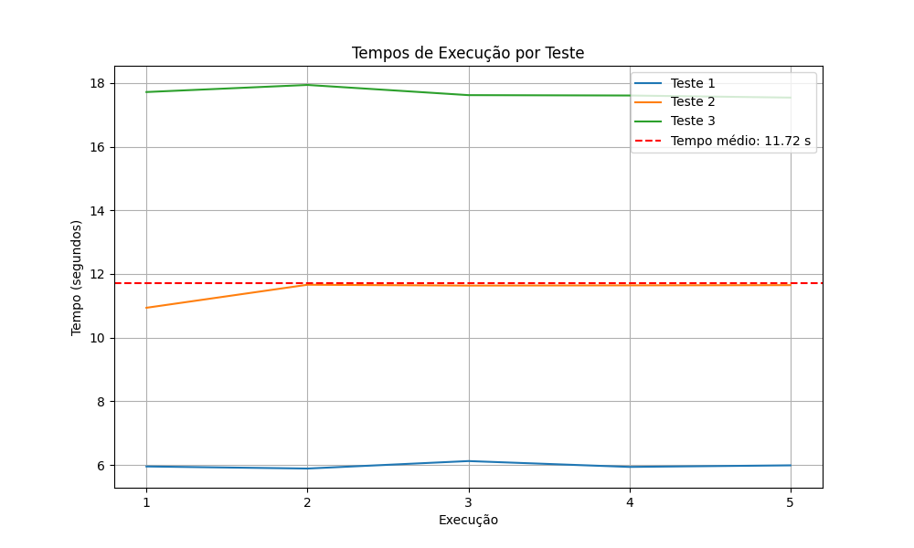
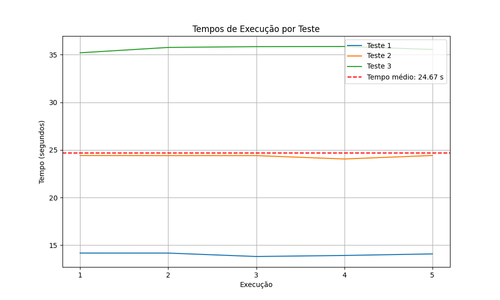
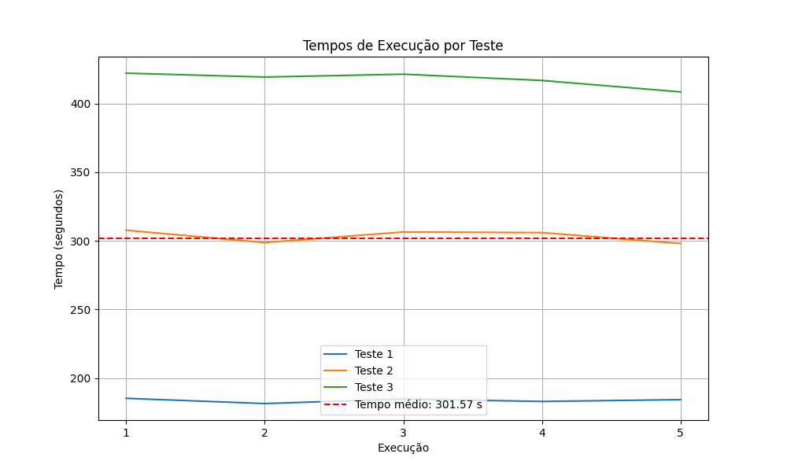
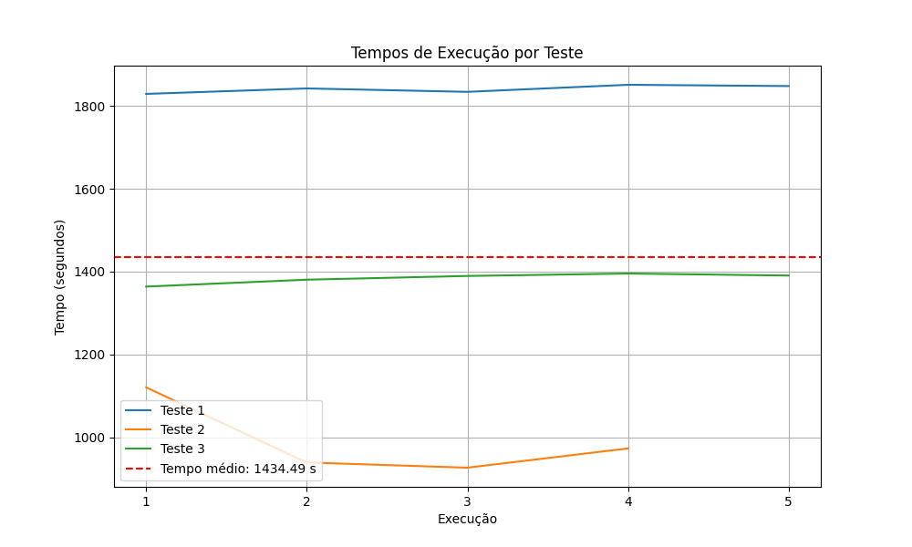
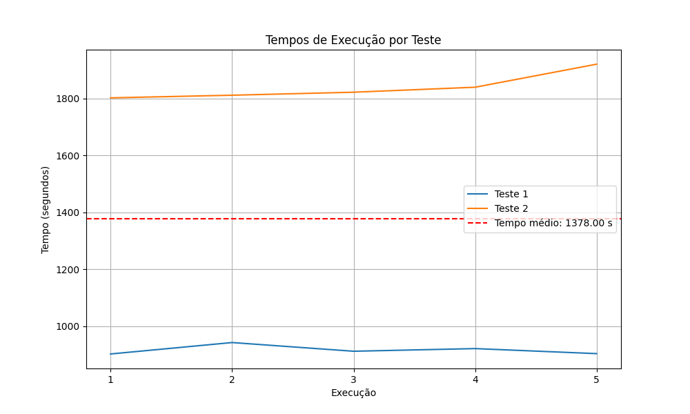

# I Desafio em Otimizacao com Metaheuristica PUC GO
# Sumário

- [Equipe](#equipe)
- [Projeto](#projeto)
  - [Sobre o Desafio](#sobre-o-desafio)
  - [Dados](#dados)
  - [Hardware e Software Utilizados](#hardware-e-software-utilizados)
  - [Metaheurísticas Testadas](#metaheurísticas-testadas)
    - [Artificial Bee Colony (ABC)](#artificial-bee-colony-abc)
    - [Ant Colony Optimization (ACO)](#ant-colony-optimization-aco)
    - [Simulated Annealing (SA)](#simulated-annealing-sa)
    - [Genetic Algorithm (GA)](#genetic-algorithm-ga)
    - [Reactive Greedy Randomized Adaptive Search Procedure (Reactive GRASP)](#reactive-greedy-randomized-adaptive-search-procedure-reactive-grasp)
  - [Resultados](#resultados) 
    - [Técnicas de Otimização](#Técnicas-de-Otimização)  
    - [Algoritmo Genético (GA)](#algoritmo-genético-ga)
      - [Parâmetros](#Parâmetros) 
      - [Crossovers](#Crossovers) 
      - [Técnicas de Seleção](#Técnicas-de-Seleção)  
      - [Ordem de Funcionamento do Algoritmo](#Ordem-de-Funcionamento-do-Algoritmo) 
    - [Reactive Greedy Randomized Adaptive Search Procedure (Reactive GRASP)](#reactive-greedy-randomized-adaptive-search-procedure-reactive-grasp-1)
      - [Parâmetros](#parâmetros-1) 
      - [Selecionador de Alfa](#selecionador-de-alfa) 
      - [Construtor de Soluções Guloso](#construtor-de-soluções-guloso) 
      - [Busca Local](#busca-local) 
      - [Ordem de Funcionamento do Algoritmo](#Ordem-de-Funcionamento-do-Algoritmo-1)
    - [Metaheurísticas Descartadas no Projeto](#Metaheurísticas-Descartadas-no-Projeto)
  - [Conclusão](#conclusão)

## Equipe:

  
  
  
  

## Projeto:
### Sobre o Desafio:
O problema do Caixeiro Viajante é um desafio clássico de otimização, que busca determinar a rota mais eficiente ou de menor custo que um viajante deve seguir para visitar uma série de cidades e retornar ao ponto de origem, sem passar duas vezes pela mesma cidade. Originado no século 19, o PCV é amplamente estudado tanto como um problema teórico quanto por suas aplicações práticas em áreas como logística, planejamento de rotas e fabricação de circuitos eletrônicos. Este desafio envolve a resolução do Problema do Caixeiro Viajante (PCV) utilizando técnicas de otimização com meta-heurísticas (MH).

### Dados:

### Hardware e Software Utilizados:

#### Software:
Foram utilizados Visual Studio Code e Visual Studio como IDES.
Algoritmo foi executado em um sistema operacional Windows.

#### Hardware
Processador: Ryzen 5600g
Memoria Ram: 16Gb
Ssd Nvme: 1Tb

### Metaheurísticas Testadas:

#### Artificial Bee Colony (ABC):
A otimização por colônia de abelhas (ABC) é uma metaheurística inspirada no comportamento de busca de alimentos das abelhas. Desenvolvida por Karaboga em 2005, a ABC é um método de otimização estocástico que simula o comportamento de busca das abelhas enquanto procuram por alimento. É uma técnica de busca baseada em população que utiliza uma estratégia de exploração e explotação para encontrar soluções ótimas ou subótimas para problemas de otimização.

Inicialmente, uma população de soluções candidatas, chamadas de "abelhas empregadas", é aleatoriamente gerada. Cada abelha empregada é então enviada para explorar uma área do espaço de busca. A qualidade das soluções é avaliada usando uma função de aptidão (fitness), que mede o quão bom é um determinado candidato em relação ao objetivo da otimização.

Após uma fase de exploração inicial, as abelhas empregadas compartilham informações sobre as fontes de alimento que encontraram com outras abelhas na colônia, conhecidas como "abelhas observadoras". As abelhas observadoras então inspecionam as fontes de alimento com base nas informações compartilhadas pelas abelhas empregadas. Elas podem escolher uma fonte de alimento com base em sua qualidade e proximidade.

Além disso, há uma fase de "abelhas exploradoras", que é responsável pela introdução de diversidade na população. Essas abelhas exploradoras procuram aleatoriamente novas soluções no espaço de busca, o que ajuda a evitar a estagnação prematura em ótimos locais subótimos.

Ao longo das iterações do algoritmo, as abelhas empregadas, observadoras e exploradoras continuam a explorar o espaço de busca, compartilhando informações e ajustando suas posições com base nas melhores soluções encontradas até o momento.

#### Ant Colony Optimization (ACO):
A Otimização por Colônia de Formigas (ACO) é uma metaheurística baseada em inspirações tiradas do comportamento das formigas ao procurarem comida. Desenvolvida por Marco Dorigo no início da década de 1990, a ACO é usada para resolver problemas de otimização, especialmente aqueles relacionados a problemas de caminho mais curto e problemas de roteamento.

Ele simula o comportamento coletivo das formigas ao procurarem caminhos entre a colônia e fontes de comida. Cada formiga, durante sua busca, deposita feromônios nos caminhos que percorre. A quantidade de feromônio depositada é proporcional à qualidade do caminho (ou à solução) encontrada. Os caminhos com mais feromônios são mais atraentes para outras formigas.

Além disso, há uma evaporação gradual dos feromônios ao longo do tempo. Isso impede que os caminhos continuem sendo atraentes indefinidamente, incentivando a exploração de novos caminhos pela colônia de formigas.

#### Simulated Annealing (SA):
A metaheurística do recozimento simulado, ou Simulated Annealing (SA) em inglês, é uma técnica de otimização inspirada no processo físico de recozimento de materiais metálicos. Desenvolvida por Kirkpatrick, Gelatt e Vecchi em 1983, o SA é usado para encontrar soluções aproximadas para problemas de otimização complexos.

Funciona de forma semelhante ao recozimento de metal: começa com uma solução inicial e, em seguida, perturba essa solução iterativamente, aceitando movimentos que levam a soluções piores em certas condições probabilísticas. Isso permite que o algoritmo escape de ótimos locais subótimos e explore o espaço de busca de forma mais eficiente.

O algoritmo é guiado por uma função de custo (ou função de energia), que avalia a qualidade de uma solução. Durante a busca, o SA tenta minimizar essa função de custo, ou seja, encontrar uma solução que minimize o valor da função.

A chave para o sucesso do SA está na manipulação da temperatura. A temperatura controla a probabilidade de aceitar soluções piores durante a busca. No início, a temperatura é alta, o que permite aceitar movimentos que levam a soluções piores com uma certa probabilidade. Isso ajuda o algoritmo a escapar de ótimos locais subótimos e explorar o espaço de busca de forma mais ampla. À medida que a busca avança, a temperatura é gradualmente reduzida, o que reduz a probabilidade de aceitar soluções piores. Isso permite que o algoritmo se concentre em refinar a solução em torno de ótimos locais locais.

Uma vez que a temperatura atinge um valor mínimo, o algoritmo termina e retorna a melhor solução encontrada durante a busca.

#### Genetic algorithm (GA):
A metaheurística genética é uma técnica de otimização baseada na evolução biológica e na genética. Desenvolvida por John Holland na década de 1960 e popularizada por Goldberg, ela é inspirada nos processos de seleção natural e evolução das espécies.

O funcionamento básico de um algoritmo genético (AG) começa com uma população inicial de soluções candidatas, chamadas de indivíduos. Cada indivíduo é representado como uma sequência de genes, onde cada gene codifica uma característica ou parte da solução para o problema de otimização. Esses indivíduos são então avaliados com base em uma função de adaptação (fitness), que mede o quão bom é um determinado indivíduo em relação ao objetivo da otimização

Em seguida, o AG emprega operadores genéticos, como seleção, cruzamento e mutação, para criar uma nova geração de indivíduos. Durante a seleção, os indivíduos mais aptos têm uma maior probabilidade de serem escolhidos para reprodução, enquanto os menos aptos têm uma menor probabilidade. Isso permite que os melhores indivíduos passem suas características para as gerações subsequentes.

Durante o cruzamento (ou crossover), os indivíduos selecionados são combinados para produzir descendentes. Isso é feito trocando partes de suas representações genéticas. A ideia é combinar boas características de diferentes indivíduos para produzir soluções potencialmente melhores.

A mutação introduz aleatoriedade no processo, alterando aleatoriamente alguns genes dos indivíduos. Isso ajuda a explorar novas regiões do espaço de busca e a evitar a estagnação prematura em ótimos locais subótimos.

O processo de seleção, cruzamento e mutação é repetido ao longo de várias gerações até que uma condição de parada seja atingida, como um número máximo de gerações ou a convergência para uma solução satisfatória.

#### Reactive Greedy Randomized Adaptive Search Procedure (Reactive GRASP)

O Reactive GRASP (Reactive Greedy Randomized Adaptive Search Procedure) é uma variante do GRASP (Greedy Randomized Adaptive Search Procedure), uma metaheurística que combina a estratégia gulosa (greedy) com uma componente aleatória para resolver problemas de otimização combinatória.

A estratégia gulosa é caracterizada pela escolha da melhor opção local em cada iteração, enquanto a aleatoriedade permite escapar de mínimos locais, explorando diferentes regiões do espaço de busca. O GRASP tradicional constrói uma solução inicial de forma gulosa e então realiza buscas locais em torno dessa solução para refiná-la.

O Reactive GRASP introduz uma variação adicional no processo, adaptando a estratégia gulosa com base no desempenho recente do algoritmo. Isso significa que, ao longo do tempo, a estratégia gulosa pode mudar para explorar diferentes áreas do espaço de busca. Essa adaptação é feita com base em informações coletadas durante a execução do algoritmo, como a qualidade das soluções encontradas.

O Reactive GRASP é particularmente eficaz em problemas onde as características do espaço de busca mudam ao longo do tempo, ou onde diferentes regiões do espaço de busca requerem diferentes abordagens de busca. Ele equilibra a exploração do espaço de busca com a exploração local, o que pode levar a uma melhor convergência para soluções de alta qualidade.

Essa abordagem reativa torna o algoritmo mais flexível e adaptável a diferentes tipos de problemas de otimização. O Reactive GRASP tem sido aplicado com sucesso em uma variedade de problemas, incluindo problemas de escalonamento, problemas de roteamento, problemas de design e muitos outros em diferentes áreas, como logística, engenharia, computação e finanças.

### Instâncias Utilizadas:
As instâncias utilizadas para testar nosso algoritmo foram obtidas da Universidade de Waterloo, localizada no Canadá.

Os conjuntos de dados foram selecionados a partir de duas fontes principais:

1. **Problemas Nacionais do Caixeiro Viajante (National Traveling Salesman Problems)**:
   - Fonte: [Página da Universidade de Waterloo sobre Problemas do Caixeiro Viajante em Nível Nacional](https://www.math.uwaterloo.ca/tsp/world/countries.html)
   - Instâncias Utilizadas:
     - Djibouti - 38 cidades
     - Qatar - 194 cidades
     - Uruguai - 734 cidades
     - Luxemburgo - 980 cidades

2. **Conjuntos de Dados VLSI (VLSI Data Sets)**:
   - Fonte: [Página da Universidade de Waterloo sobre Conjuntos de Dados VLSI](https://www.math.uwaterloo.ca/tsp/vlsi/index.html#XQF131)
   - Instâncias Utilizadas:
     - xqf131 - 131 pontos

Essas instâncias foram escolhidas por sua representatividade e desafio computacional, cobrindo uma variedade de tamanhos de problema que variam de pequenos conjuntos de cidades a conjuntos de dados VLSI mais complexos.

# Resultados:

## Técnicas de Otimização

Otimizadores desempenham um papel crucial ao explorar a vizinhança e, quando necessário, introduzir mutações nos caminhos.

- **opt_1:** Operador de Mutação por Troca Única, onde dois pontos aleatórios no caminho são trocados.
- **opt_2:** Operador de Mutação por Inversão, onde todos os pares de cidades são percorridos e suas posições são invertidas.
- **opt_2s:** Variação do opt_2, em que dois pontos são escolhidos aleatoriamente e todo o caminho entre eles é invertido.

## Meta-heurísticas Escolhidas

### Algoritmo Genético (GA)

A meta-heurística genética implementada passou por ajustes e incluiu implementações extras para melhorar sua eficiência, organização e desempenho em comparação ao algoritmo base. Abaixo estão listados os parâmetros implementados:

#### Parâmetros
- **max_generations:** Número máximo de gerações.
- **max_population:** Tamanho máximo da população.
- **opt_range:** Define a probabilidade de um gene ser selecionado para mutação. (Quanto maior, maior a probabilidade de mutação)
- **opt_path_swap_it:** Número de iterações no otimizador de caminho. (Mais iterações resultam em otimização adicional)
- **tx_elite:** Taxa de elitismo na população.
- **verbose:** Ativa ou desativa o modo verboso.
- **simple_verbose:** Ativa ou desativa o modo de verbosidade simplificada.
- **alpha:** Porcentagem do gene do pai em relação ao da mãe (apenas para o crossover AHCAVG).
- **balance:** Define a porcentagem de elitismo para a nova geração (0 desativa o elitismo).
- **tx_mutation_AHCAVG:** Taxa de mutação na média aritmética (apenas para o crossover AHCAVG).
- **fix_init:** Número inicial fixo (usar -1 para desativar).
- **P_value:** Quantos pais são considerados (apenas para o crossover VR).
- **P_limiar:** Quantidade mínima para a cidade aparecer na mesma posição dos pais (apenas para o crossover VR).
- **cross_active:** Lista de cruzamentos ativos ("BCR" -> Melhor Rota de Custo, "AHCAVG" -> Média Aritmética, "ER" -> Recombinação de Borda, "VR" -> Recombinação de Votação, "PMX" -> PMX).

#### Crossovers:

- **PMX (Partially Mapped Crossover)**: Este é o principal método de crossover do algoritmo, oferecendo um dos melhores desempenhos em diversos datasets quando comparado a outras técnicas de crossover. É o único dos crossovers que sempre esta ativo.

- **BCR (Best Cost Route Crossover)**: Este crossover é extremamente poderoso, funcionando de forma semelhante ao opt2. No entanto, sua implementação pode ser custosa em termos de desempenho, podendo causar lentidão significativa em testes extensos. Por esse motivo, é o único dos crossovers que possui uma taxa de utilização programável, variando de 0% a 100%.

- **VR (Voting Recombination Crossover)**: Este crossover é altamente eficiente para induzir mutações e detectar pequenas semelhanças entre os caminhos já encontrados.

- **ER (Edge Recombination Crossover)**: Esta técnica de crossover consegue detectar semelhanças entre pontos adjacentes com facilidade, o que permite encontrar novas soluções vizinhas de forma eficaz.

#### Técnicas de Seleção

Foram implementadas três técnicas de seleção, sendo que a seleção aleatória está desativada por padrão devido à sua ineficiência ao explorar os caminhos vizinhos. As técnicas de torneio e roleta provaram ser mais eficientes e gerar descobertas melhores em vizinhos, garantindo um crossover mais eficaz e desempenho superior.

- **Seleção por Torneio**: Neste método, vários indivíduos são selecionados aleatoriamente da população e competem entre si. O indivíduo com o melhor desempenho (ou fitness) é escolhido como pai ou mãe para a próxima geração. O tamanho do torneio (ou seja, o número de indivíduos selecionados para competir) é um parâmetro que pode ser ajustado para controlar a pressão seletiva.

- **Seleção por Roleta**: Também conhecida como seleção proporcional de aptidão, este método atribui a cada indivíduo uma fatia de uma "roleta" proporcional ao seu fitness relativo. Em seguida, uma "seta" é girada aleatoriamente na roleta, com mais probabilidade de parar nas fatias maiores (ou seja, nos indivíduos com maior fitness). Isso permite que os indivíduos com melhor desempenho tenham uma maior probabilidade de serem selecionados como pais ou mães para a próxima geração.

- **Seleção Aleatória (desativada por padrão)**: Este método simplesmente seleciona indivíduos aleatoriamente da população para reprodução, sem levar em consideração o seu fitness. No entanto, devido à sua natureza aleatória, a seleção aleatória geralmente não é tão eficaz quanto os métodos de torneio e roleta, especialmente ao explorar os caminhos vizinhos em busca de soluções ótimas. Por isso, esta técnica está desativada por padrão no algoritmo.
  
#### Ordem de Funcionamento do Algoritmo

No algoritmo genético, o processo é dividido em cinco etapas:

- **Ordenação da População com Base no Fitness:** Os indivíduos são classificados, com os de menor fitness sendo priorizados antes dos de maior fitness.

- **Seleção dos Genes por Elitismo:** Uma porcentagem da população é preservada diretamente para a próxima geração, sendo otimizada com a técnica opt_2s.

- **Aplicação do Crossover entre Dois Indivíduos:** Dois indivíduos são selecionados usando uma das [técnicas de seleção](#Técnicas-de-Seleção), seguido pela aplicação de um ou mais [crossovers](#Crossovers).

- **Mutação dos Indivíduos ou Otimização:** O **opt_range** define o intervalo de otimização, determinando se um indivíduo fora da elite será otimizado ou sofrerá uma mutação, com base em alguma das [técnicas de seleção](#Técnicas-de-Seleção).

- **Salvamento dos Novos Genes para a Próxima Geração:** Os novos genes são armazenados para uso na próxima iteração do algoritmo.

### Reactive Greedy Randomized Adaptive Search Procedure (Reactive GRASP)

#### Parâmetros
- l: Número de iterações.
- m: Número de parâmetros alfa.
- cont_alpha: Contador para cada parâmetro alfa.
- p_alpha: Probabilidade de selecionar cada parâmetro alfa.
- solution_alpha: Custo acumulado para cada parâmetro alfa.
- alfa: Vetor de parâmetros alfa.
- beta: Parâmetro beta para atualização de probabilidades.
- best_solution: Melhor solução encontrada pelo algoritmo.
- best_cost: Custo da melhor solução encontrada.

#### Selecionador de Alfa
- O alfa é selecionado com base em um vetor de probabilidade para todos os alfas. Essa probabilidade é atualizada a "beta" vezes. Dessa forma, alfas que produziram melhores respostas anteriormente têm mais chances de serem selecionados novamente.

#### Construtor de Soluções Guloso
- O construtor de soluções que utiliza a ideia do método guloso para resolver o TSP. É passado um alfa do vetor como parâmetro, que é utilizado para encontrar o limiar de pontos que serão aceitos nesse caminho. Desta forma, ele começa de um ponto aleatório e acrescenta um a um pontos que sejam menores que o limiar definido pelo alfa, respeitando a seguinte fórmula: (candidato <= candidatoMenosDistante + alfa * (candidatoMaisDistante - candidatoMenosDistante)).

#### Busca Local
- Foi implementada uma variação do operador de Mutação por Inversão opt_2, onde todos os pares de cidades são percorridos e suas posições são invertidas. Os pares são invertidos e, em seguida, é calculado o novo custo. Se for verificado que o custo do caminho é menor, a inversão é mantida; caso contrário, é revertida. Dessa forma, a cada iteração, é feita a busca por todas as soluções vizinhas da gerada pelo construtor de soluções, a fim de encontrar a melhor.

#### Ordem de Funcionamento do Algoritmo

No algoritmo Reactive GRASP, o processo é dividido em quatro etapas:

1. É gerada uma nova solução pelo construtor de soluções.
2. Inicia-se uma busca local por essa solução a fim de melhorá-la.
3. Avalia a nova solução em comparação com a melhor encontrada anteriormente encontrada.
4. Atualiza a probabilidade dos alfas para a próxima iteração.

## Metaheurísticas Descartadas no Projeto

- **Artificial Bee Colony (ABC):**
  - O ABC é uma técnica poderosa de otimização inspirada no comportamento das abelhas. Durante sua implementação, desenvolvemos um algoritmo simples e teórico. No entanto, nos testes realizados, o algoritmo não produziu resultados satisfatórios. Embora tenha apresentado um tempo de execução eficiente, observamos um erro considerável em comparação com as soluções conhecidas das instâncias utilizadas. Na busca por melhorias, não encontramos literatura adequada para otimizá-lo especificamente para problemas de TSP. Diante disso, optamos por descartar o ABC em favor de um algoritmo mais robusto com o qual já tínhamos familiaridade.

- **Simulated Annealing (SA):**
  - O SA é um algoritmo amplamente conhecido na área de otimização. Durante sua primeira implementação, sua teoria parecia simples e direta. No entanto, encontramos um desafio significativo: ele frequentemente ficava preso em ótimos locais subótimos devido à sua estrutura simples e à falta de aleatoriedade suficiente. Diante dessa limitação, decidimos descartá-lo em favor de um algoritmo mais robusto, capaz de oferecer maior flexibilidade na otimização e explorar uma gama mais ampla de soluções.

- **Otimização por Colônia de Formigas (ACO):**
  - O ACO é uma técnica de otimização inspirada no comportamento das formigas que demonstrou grande promessa em teoria. Durante sua implementação inicial, desenvolvemos um algoritmo simples e elegante, espelhando os princípios fundamentais do comportamento das formigas na natureza. No entanto, ao testá-lo em problemas do mundo real, encontramos algumas limitações significativas. Embora tenha mostrado eficiência em termos de tempo de execução, observamos que sua capacidade de encontrar soluções ótimas foi comprometida em várias instâncias de problemas. A falta de ajuste fino para contextos específicos, como o problema do Caixeiro Viajante (TSP), resultou em soluções menos competitivas em comparação com algoritmos concorrentes mais robustos. Diante dessa realidade, decidimos abandonar o ACO em favor de algoritmos mais sofisticados, capazes de lidar melhor com a complexidade dos problemas de otimização que enfrentamos.
 
## Testes

### Tempo com cada população:

| X | POPULAÇÂO 31 | POPULAÇÂO 67 | POPULAÇÂO 103 |
|----------|----------|----------|----------|
|dj38| 5.93696  | 11.636  | 17.621 |
|berlin52| 14.0839  | 24.4022  | 35.7595  |
|xqf131| 184.285  | 305.984  | 419.293  |
|qa194| 1834.21   | 926.236   | 1389.44  |
|uy734| 912.432   | x   | 1920.54   |
|lu980| 145.502   | x   | x   |

#### Tempo dj38:

#### Tempo berlin52:

#### Tempo xqf131:

#### Tempo qa194:

#### Tempo uy734:

### Moda da resposta em relação a cada população:

| X | POPULAÇÂO 31 | POPULAÇÂO 67 | POPULAÇÂO 103 | RESPOSTA |
|----------|----------|----------|----------|----------|
|dj38| 6659.43  | 6659.43  | 6659.43 |6656|
|berlin52| 7661.01  | 7729.5  | 7777.33  |7544|
|xqf131| 602.424  | 593.323  |  598.507  |564|
|qa194| 9995.71   | 10193.7   | 10014.9  |9352|
|uy734| 90801   | x   | 88365   |79114|
|lu980| 16415   | x   | x   |11340|

### Conclusão: 

Concluindo, neste trabalho exploramos duas poderosas meta-heurísticas para resolver o Problema do Caixeiro Viajante (TSP): o algoritmo genético (AG) e o Reactive GRASP. Ambas as abordagens mostraram sua eficácia na obtenção de soluções de alta qualidade para o TSP, um problema conhecido por sua complexidade.

O AG revelou-se robusto e versátil, capaz de explorar amplamente o espaço de busca e encontrar soluções competitivas. Sua natureza baseada em populações e operadores genéticos permitiu uma busca global eficiente, adaptando-se bem a diferentes instâncias do problema.

Por outro lado, o Reactive GRASP destacou-se por sua capacidade de adaptação dinâmica durante o processo de busca. Ao ajustar a probabilidade dos alfas com base no desempenho das soluções encontradas, o Reactive GRASP demonstrou uma capacidade única de explorar o espaço de busca de forma mais inteligente e eficaz, adaptando-se às características específicas do problema em questão.

Além disso, é importante destacar a possibilidade de aprofundar os estudos nos demais algoritmos testados, que têm muito potencial ainda não explorado.

Em última análise, este estudo demonstra que tanto o algoritmo genético quanto o Reactive GRASP são ferramentas poderosas e complementares na resolução de problemas complexos como o TSP, oferecendo soluções de alta qualidade e abrindo caminho para pesquisas futuras em meta-heurísticas e otimização combinatória.

